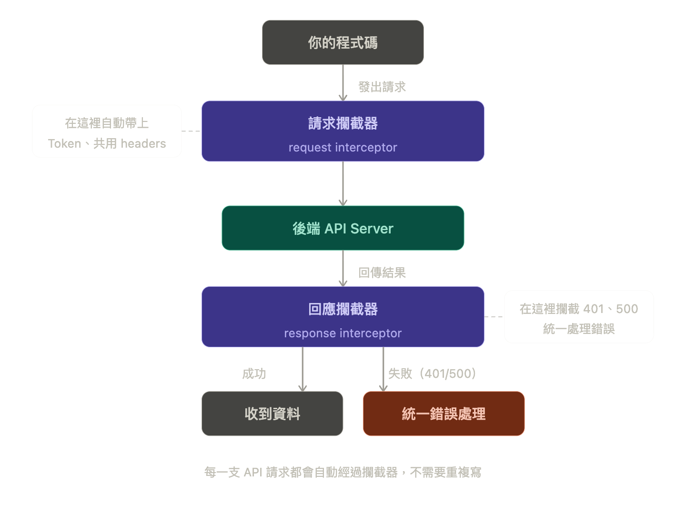

> 實務上處理 Token 過期、統一錯誤處理（如 401, 500）都會用到

## 5.8 Axios 攔截器（Interceptors）

### 檔案位置

通常會獨立一個 axios 檔案（請依照公司實際規定）

```bash
src/
 ├── api/
 │    └── axios.js
```

### 用途說明

1.  自動帶 Token
2.  統一錯誤處理（401 / 500）

你的專案有 10 支 API，每一支都需要帶 Token，你現在的寫法大概是這樣：

```js
axios.get("/api/products", { headers: { Authorization: `Bearer ${token}` } });
axios.post("/api/orders", data, {
  headers: { Authorization: `Bearer ${token}` },
});
axios.delete("/api/products/1", {
  headers: { Authorization: `Bearer ${token}` },
});
// ...每一支都要寫一次
```

又或者每一支 API 都要自己處理錯誤：

```js
try { ... } catch(err) {
  if (err.response?.status === 401) { // 每支都寫一次
    alert("請重新登入");
  }
}
```

這樣很累，而且萬一要改，要改 10 個地方。



### 範例（請求攔截）

```jsx
axios.interceptors.request.use((config) => {
  // config 就是這次請求的所有設定
  // 你可以在這裡塞東西進去，然後把 config 還回去
  const token = localStorage.getItem("token");
  if (token) config.headers.Authorization = `Bearer ${token}`;
  return config; // 一定要 return，否則請求就停在這不動了
});
```

### 範例（回應攔截）

```jsx
axios.interceptors.response.use(
  (response) => response, // 成功：直接放行，不動它
  (error) => {
    // 失敗：在這裡統一處理
    if (error.response?.status === 401) {
      window.location.href = "/login"; // 自動導回登入頁
    }
    return Promise.reject(error); // 把錯誤繼續往外丟，讓各自的 catch 還是能收到
  }
);
```

### 實務用途

- Token 自動帶入
- API 錯誤統一處理
- 登入失效自動導頁
