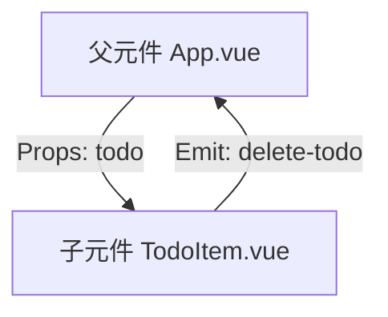

> 在 Vue 中，父子元件透過 **Props** 與 **Emit** 建立「單向資料流」：
>
> - **父 → 子**：使用 **Props** 傳遞資料。
> - **子 → 父**：使用 **Emit** 傳遞事件。

## 1. 範例需求

建立一個 **TodoList**：

- 父元件：維護 Todo 清單。
- 子元件：顯示單筆 Todo，並能觸發刪除。

## 2. 子元件：TodoItem.vue

```vue
<!-- src/components/TodoItem.vue -->
<template>
  <li>
    <span>{{ todo.text }}</span>
    <button @click="$emit('delete-todo', todo.id)">刪除</button>
  </li>
</template>

<script setup>
defineProps({
  todo: {
    type: Object,
    required: true,
  },
});

defineEmits(["delete-todo"]);
</script>
```

📌 **說明**

- `todo` 透過 **Props** 從父元件傳入。
- 觸發 `delete-todo` 事件，並把 `todo.id` 傳回父元件。

## 3. 父元件：App.vue

```vue
<!-- src/App.vue -->
<script setup>
import { ref } from "vue";
import TodoItem from "./components/TodoItem.vue";

const todos = ref([
  { id: 1, text: "學習 Vue3" },
  { id: 2, text: "寫筆記" },
  { id: 3, text: "練習專案" },
]);

const deleteTodo = (id) => {
  todos.value = todos.value.filter((todo) => todo.id !== id);
};
</script>

<template>
  <h1>我的代辦清單</h1>
  <ul>
    <TodoItem
      v-for="item in todos"
      :key="item.id"
      :todo="item"
      @delete-todo="deleteTodo"
    />
  </ul>
</template>
```

📌 **說明**

- 父元件透過 `:todo="item"` 把每筆資料傳給子元件。
- 子元件按下「刪除」按鈕 → 觸發 `delete-todo` → 父元件的 `deleteTodo` 方法處理。

## 4. 資料流示意圖



## 5. 小結

- **Props**：父傳子 → 傳遞資料。
- **Emit**：子傳父 → 通知事件。
- 父子元件透過這兩者形成完整的單向資料流。
