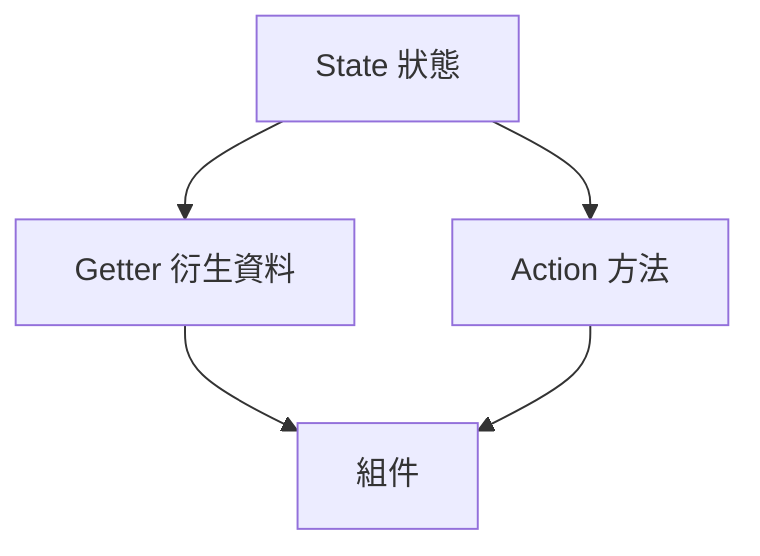

## 1. 為什麼要用 Pinia？

在 Vue3 中，隨著專案變大，**跨組件之間的資料共享** 會變得複雜。  
常見的解法有：

- 父子元件 → 用 Props / Emit。
- 跨層級元件 → 可能需要「Props 一層層傳遞」，或使用 provide/inject。

這些方法在簡單情境下可以，但在大型應用中會造成維護困難。  
因此需要一個 **集中管理狀態的工具**，這就是 **Pinia**。

📌 Pinia 是 Vue 官方推薦的 **狀態管理庫**，可以想像成 Vuex 的下一代版本：

- 更簡單、直觀的 API。
- 完全支援 TypeScript。
- 與 Composition API 高度整合。

## 2. 安裝 Pinia

在 Vue3 專案中安裝 Pinia：

```bash
npm install pinia
```

:::info
可在專案做到一半時選擇使否使用 Pinia，或是在一開始建立專案時就安裝，因為設定上不會像 Router 那麼的複雜，如果是做到一半才打算安裝 Router，會比較建議直接重新建立專案
:::

## 3. 在專案中啟用 Pinia

安裝後，需要在 `main.js` 中註冊 Pinia。

```javascript
// src/main.js
import { createApp } from "vue";
import { createPinia } from "pinia";
import App from "./App.vue";

const app = createApp(App);
const pinia = createPinia();

app.use(pinia); // 全域使用 Pinia
app.mount("#app");
```

📌 **重點**

- `import { createPinia } from 'pinia'` 匯入 Pinia 功能。
- `const pinia = createPinia()` 建立一個 Pinia 實例。
- `app.use(pinia)` 把 Pinia 注入整個 Vue 應用。

## 4. Pinia 的基本概念

Pinia 的核心概念類似「小型的資料倉庫 (Store)」：

- **State** → 資料（類似元件的 data）。
- **Getter** → 衍生資料（類似 computed）。
- **Action** → 方法/邏輯（類似 method，可以包含非同步請求）。

結構圖：



## 5. 小結

- Pinia 用來集中管理 Vue 應用中的資料狀態。
- 它是 Vue3 官方推薦的狀態管理工具，比 Vuex 更簡單。
- 使用流程：
  1.  安裝並在 `main.js` 啟用。
  2.  定義 Store（集中存放狀態）。
  3.  在組件中讀取/修改 Store。
